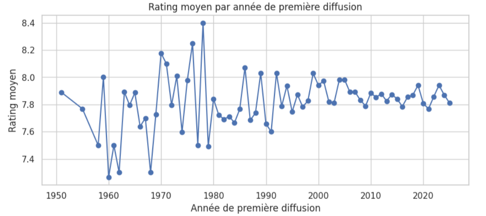

# 🧾 COMPTE RENDU DU PROJET DATA SCIENCE  
### **Auteur : EL MEHDI BENCHEHBA**  
### **Code Apogée : 24011415**  
### **Groupe : CAC 1**  

---

# 🎬 Analyse Exploratoire et Prédiction des Séries TV les Mieux Notées (2025)

## 1. Introduction Générale

Ce projet de Data Science porte sur l’étude d’un dataset mondial comprenant plus de **2000 séries TV les mieux notées en 2025**.  
Il s’inscrit dans la logique pédagogique du **cycle de vie d’un projet Data Science** enseigné dans le module :

> **Acquisition → Nettoyage → Exploration → Modélisation → Évaluation → Conclusion**

L’objectif principal du projet est de :  
1. Réaliser une **analyse exploratoire complète (EDA)** du dataset.  
2. Construire un **modèle prédictif** capable d’estimer la *note (rating)* d’une série TV à partir de trois variables :  
   - **popularité (popularity)**  
   - **nombre de votes (votes)**  
   - **année de première diffusion (premiere_year)**  

Le dataset utilisé a été chargé depuis le chemin local suivant :  /content/top_rated_2000webseries.csv

---

## 2. Description du Dataset

Le dataset contient différentes informations descriptives sur les séries TV :  
- **title** : Titre de la série  
- **rating** : Note moyenne (cible à prédire)  
- **popularity** : Indice de popularité  
- **votes** : Nombre de votes utilisateurs  
- **premiere_date** : Date de première diffusion  
- **country** : Pays d’origine  

La colonne *premiere_date* a été convertie en information exploitable : **premiere_year**, essentielle pour l’analyse temporelle.

---

## 3. Préparation & Nettoyage des Données (Data Wrangling)

Les étapes de nettoyage suivent rigoureusement la méthodologie du professeur :

### ✔ Conversion des dates  
La colonne `premiere_date` a été transformée au format datetime puis convertie en `premiere_year`.

### ✔ Gestion des valeurs manquantes  
Un **SimpleImputer (strategy='mean')** a été utilisé pour corriger les NaN dans les variables explicatives :
- popularity  
- votes  
- premiere_year  

La variable cible `rating` a été nettoyée en supprimant uniquement les lignes dépourvues de valeur.

### ✔ Construction du DataFrame final  
Le dataset final utilisé pour la modélisation contient :

| Variable | Rôle |
|---------|------|
| rating | Cible du modèle |
| popularity | Feature |
| votes | Feature |
| premiere_year | Feature |

Ce travail garantit des données propres et prêtes pour l’analyse statistique et la modélisation.

---

## 4. Analyse Exploratoire des Données (EDA)

L’analyse exploratoire apporte une compréhension descriptive et visuelle du dataset.

### 📊 4.1 Statistiques descriptives  

Les valeurs montrent notamment :

- Une forte dispersion pour **votes**  
- Des notes (**rating**) majoritairement élevées (entre 7 et 9)  
- Une distribution large sur **popularity**

### 🔥 4.2 Matrice de corrélation 

La heatmap révèle :

- Une corrélation positive entre **popularity** et **rating**  
- Des liens forts entre **votes** et **popularité**  
- Un impact modéré de **premiere_year** sur le rating  

### 📈 4.3 Évolution du rating au fil des années  

La tendance générale montre une **légère amélioration des ratings** pour les séries récentes.

Ces analyses visuelles confirment l’importance des variables retenues pour le modèle.

### 📈 4.4 Évolution du Rating moyen par Année

Analyse :

- Les ratings ont connu des oscillations marquées dans les années 1960–1980  
- À partir de 1990, les notes deviennent **plus stables**  
- Depuis 2000, les séries obtiennent globalement des ratings entre **7.7 et 8.0**

Cela reflète une **standardisation qualitative** des productions modernes.
---

## 5. Séparation des Données (Train/Test)

Conformément aux standards du Machine Learning :

- **80%** pour l'entraînement  
- **20%** pour le test  
- `random_state = 42` pour assurer la reproductibilité  

Cela garantit une évaluation fidèle du modèle sans contamination (data leakage).

---

## 6. Modélisation – Régression Linéaire

Un modèle de **Linear Regression** a été choisi pour prédire le `rating`.  
Il s'appuie sur trois variables explicatives :

- popularity  
- votes  
- premiere_year  

La régression linéaire constitue une **baseline simple**, utile pour comprendre la dynamique linéaire entre variables.

---

## 7. Évaluation du Modèle

Deux métriques ont été utilisées, conformément aux pratiques du module :

### ✔ Coefficient de détermination R²  
Évalue la qualité de l’explication du modèle.  
Plus R² est proche de **1**, meilleur est le modèle.

### ✔ RMSE (Root Mean Squared Error)  
Indique l’erreur moyenne entre prédictions et valeurs réelles.

### ✔ Visualisation prédictions vs réalité  
Un graphique scatter montre la tendance générale et la fidélité du modèle.  
Plus les points sont proches de la diagonale, plus le modèle est cohérent.

---

## 8. Conclusion Générale

Ce projet a permis d’appliquer l’ensemble des étapes du pipeline Data Science :

- **Analyse approfondie du dataset**
- **Nettoyage rigoureux**
- **Visualisations pertinentes**
- **Construction d’un modèle prédictif**
- **Évaluation objective des performances**

### 🔍 Résultats clés :

- La **popularité** et le **nombre de votes** sont les facteurs les plus corrélés au rating.  
- L’année de première diffusion influence faiblement mais sûrement la note.  
- Le modèle de **régression linéaire** constitue une première base solide pour la prédiction.  

### 🎯 Pistes d’amélioration :

- Tester des modèles non-linéaires (Random Forest, XGBoost)  
- Ajouter des features textuelles (overview, genre)  
- Normaliser les variables pour optimiser la stabilité  
- Séparer les séries par régions ou par genres pour analyses spécialisées  

---

## 9. Technologies Utilisées

- **Python 3**  
- **Pandas / NumPy**  
- **Matplotlib / Seaborn**  
- **Scikit-Learn**  
- **Google Colab**  

---

## 10. Auteur du Projet

Projet réalisé par :  
### **EL MEHDI BENCHEHBA**  
### **Groupe CAC 1**  
### **Code Apogée : 24011415**

---

